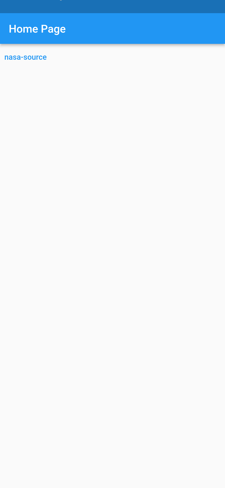
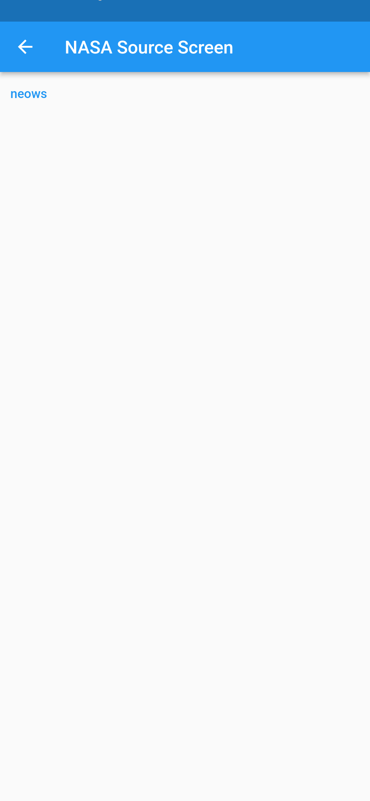
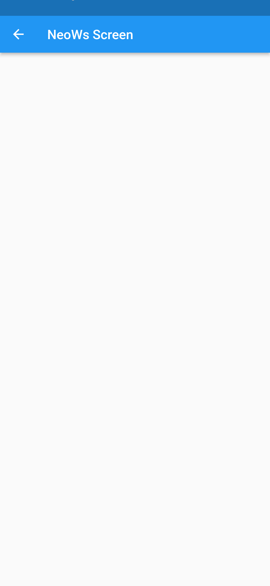

# space_data_explorer

[![ci-schedule][ci-badge]][ci-link]
[![codecov][codecov-badge]][codecov-link]

&nbsp;&nbsp;<a href='https://apps.apple.com/us/app/space-data-explorer/id6471949704'>
  <picture>
    <source media='(prefers-color-scheme: dark)' srcset='assets/apple/app-store-black-badge.svg'/>
    
  </picture>
</a>

Web - https://space-data-explorer.web.app  

The intended purposes of this project are as follows:
- An app to explore space data from various sources.
- A portfolio project to showcase the work using Flutter SDK.
- To incorporate best engineering practices.
- To demonstrate how team work can be done with less friction with the help of Test cases and Coverage.

To contribute or run the project, please refer to [`CONTRIBUTING.md`].

# Screeshots

### Home Screen

### Nasa Screen

### SBDB Close Approach Data Screen

### Settings Screen

[ci-badge]: https://github.com/hrishikesh-kadam/space_data_explorer/actions/workflows/ci-schedule.yml/badge.svg
[ci-link]: https://github.com/hrishikesh-kadam/space_data_explorer/actions/workflows/ci-schedule.yml
[codecov-badge]: https://codecov.io/gh/hrishikesh-kadam/space_data_explorer/branch/dev/graph/badge.svg
[codecov-link]: https://codecov.io/gh/hrishikesh-kadam/space_data_explorer
[`CONTRIBUTING.md`]: CONTRIBUTING.md
